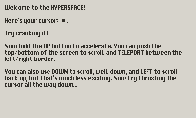

Welcome to ORBIT, a web browser for Playdate!

Follow [instructions](https://help.play.date/games/sideloading/) to upload [`ORBIT.pdx`](https://github.com/remysucre/ORBIT/tree/main/ORBIT.pdx) to your device.
To build, run `pdc Source ORBIT`.

**CONTROLS**

- CRANK - Aim cursor direction
- UP - Thrust cursor forward
- DOWN/LEFT - Scroll page up/down
- RIGHT - Activate link (when hovering)

**CONTENT FORMAT**

ORBIT uses the [md0 format](MD0.md) for page content - a simple plain text format inspired by Markdown.

**ACKNOWLEDGEMENT**

ORBIT took inspiration from [HYPER METEOR](https://play.date/games/hyper-meteor/)
and the [Constellation Browser](https://particlestudios.itch.io/constellation-browser).
The font used is [SYSTEM6](https://mmedal.itch.io/system6-playdate-font) created by [mmedal](https://mmedal.itch.io).
